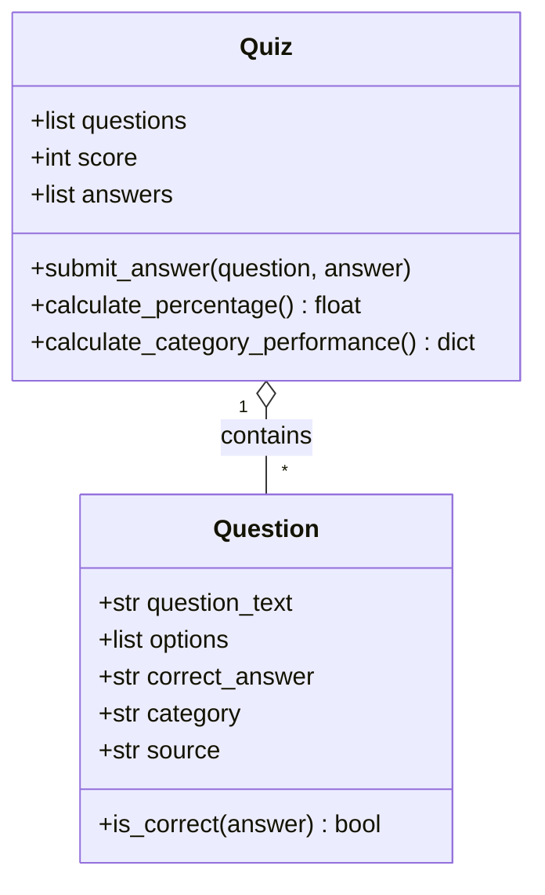
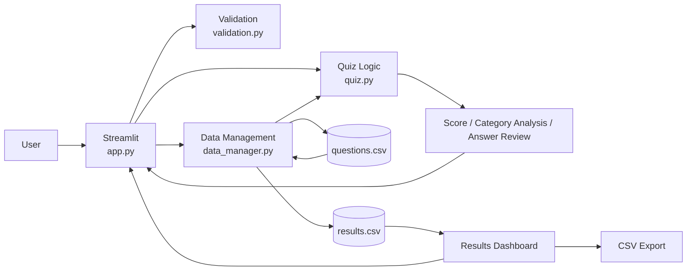

# UK Generations & Consumer Insight Quiz

## Introduction

The UK Generations & Consumer Insight Quiz is a workplace-focused Python application developed for UK Greetings. The application is primarily intended for colleagues within the Consumer Insight team, although it could also be useful for the Business Intelligence (BI) team. Its purpose is to help colleagues test and develop their knowledge of UK generational demographics and consumer characteristics through an interactive multiple-choice quiz.

Generational knowledge is relevant to the work of the Consumer Insight team because different generations can demonstrate different purchasing behaviours and preferences. Within the greetings-card market, this can include differences in preferred card designs and the occasions for which consumers purchase cards. Population size is also important because understanding the relative size of different generations can provide useful context when considering which consumer groups may represent important target audiences.

The Consumer Insight team may be asked by other areas of UK Greetings to provide insight relating to particular generations. It is therefore valuable for the team to maintain a good understanding of generational definitions, population characteristics and behavioural differences. This workplace relevance was the main reason I selected the topic rather than developing a generic knowledge or mathematics quiz.

The quiz contains ten questions using statistics from Statista reports, including data originally sourced from organisations such as the Office for National Statistics (ONS) and Ipsos. Each question displays its category and source so that the provenance and context of the information remain visible to the participant.

The original minimum viable product (MVP) covered participant-name validation, a multiple-choice quiz, scoring and persistent result storage. Once the core functionality was working reliably, I extended the application with category-level performance analysis, answer review, a results dashboard, data visualisation and CSV export. Python provides the core application logic, Streamlit the graphical interface, pandas the data handling, and pytest and GitHub Actions support automated testing and continuous integration.

---

## Design

### GUI Design

Before implementation, a low-fidelity GUI prototype was created in PowerPoint to plan the main stages of the application interface.

The first screen shows the planned quiz interface, including participant name entry, multiple-choice questions, data provenance and quiz submission.


The second screen shows the planned results interface, including the overall result, category performance, answer review and results dashboard.


The prototype established the intended progression from quiz completion to feedback and results analysis. The final Streamlit implementation retained this overall structure while the presentation and functionality were refined during development.

### User Journey


The journey includes both successful and error-handling paths. Invalid names return to name entry and incomplete quizzes produce a warning rather than a partial result.

### Functional Requirements

| ID | Requirement |
|---|---|
| FR1 | Accept and validate a participant name. |
| FR2 | Load ten multiple-choice questions from CSV storage. |
| FR3 | Allow questions to be answered through a GUI and prevent incomplete submission. |
| FR4 | Calculate score, percentage and a 70% pass threshold. |
| FR5 | Display category-level performance and post-quiz answer review. |
| FR6 | Save completed results persistently. |
| FR7 | Display stored results, summary metrics and performance over time. |
| FR8 | Allow stored results to be exported as CSV. |

### Non-functional Requirements

| ID | Requirement |
|---|---|
| NFR1 | Provide a clear and easy-to-use interface. |
| NFR2 | Handle invalid input and data errors without crashing. |
| NFR3 | Keep core logic independently testable and modular. |
| NFR4 | Use meaningful names, type hints, comments and docstrings. |
| NFR5 | Persist results between application sessions. |
| NFR6 | Run automated tests through continuous integration. |

### Technology Stack

| Technology | Purpose |
|---|---|
| Python 3.14.4 | Core programming language |
| Streamlit | Graphical user interface |
| pandas | CSV and DataFrame processing |
| pytest | Automated testing |
| Git/GitHub | Version control |
| GitHub Actions | Continuous integration |
| CSV | Persistent data storage |
| Mermaid | Technical diagrams |

### Code Design



`Question` represents one multiple-choice question and checks whether an answer is correct. `Quiz` manages the question collection, score, submitted answers, percentage and category analysis. Separating this business logic from Streamlit made it easier to test independently and reduced coupling between presentation and scoring.

### Application Architecture



The modular architecture separates interface, validation, quiz logic and data management. This improves maintainability and allows core behaviour to be tested without the graphical interface.

---

## Development

### Core Logic and Object-Oriented Design

The `Question` and `Quiz` classes in `quiz.py` contain the core object-oriented logic. `Question.is_correct()` encapsulates answer checking, while `Quiz.submit_answer()` updates the score and records each response.

The following method is taken directly from the final `Quiz` class:

```python
def submit_answer(self, question: Question, answer: str) -> None:
    """Submit an answer, record it and update the score when correct."""
    # Use the Question object's method to determine whether the answer is correct.
    is_correct = question.is_correct(answer)

    if is_correct:
        self.score += 1

    # Keep an answer history for later category analysis and answer review.
    self.answers.append(
        {
            "question": question,
            "answer": answer,
            "is_correct": is_correct
        }
    )
```

The `Quiz` object delegates answer checking to the supplied `Question` rather than duplicating the comparison. Recording the answer and its correctness allows the same data to support category analysis and answer review.

`calculate_percentage()` also handles an empty quiz by returning `0.0`, preventing division by zero. `calculate_category_performance()` uses a nested dictionary to group submitted answers by category, count correct responses and calculate a percentage for each area.

### Data Handling and Persistence

Questions are stored in `data/questions.csv` rather than being hard-coded into the interface. `data_manager.py` reads the file into a pandas DataFrame and converts each row into a `Question` object:

```python
data = pd.read_csv(file_path)

questions = []

for _, row in data.iterrows():
    question = Question(
        question_text=row["question"],
        options=[
            row["option_a"],
            row["option_b"],
            row["option_c"],
            row["option_d"]
        ],
        correct_answer=row["correct_answer"],
        category=row["category"],
        source=row["source"]
    )

    questions.append(question)
```

This separates quiz content from application logic, making the question set easier to maintain.

Completed attempts are written to `data/results.csv` with the participant name, timestamp, score, total questions, percentage and result. pandas also provides the DataFrame used to calculate dashboard metrics, visualise previous scores and export stored results.

### Validation and Exception Handling

`validation.py` separates participant-name validation from the Streamlit interface. The final validation function is:

```python
def validate_name(name: str) -> bool:
    """Return True when a name contains letters and spaces only."""
    # Remove leading/trailing whitespace before applying validation.
    cleaned_name = name.strip()

    # Accept alphabetic names with optional single spaces between words.
    return bool(re.fullmatch(r"[A-Za-z]+(?: [A-Za-z]+)*", cleaned_name))
```

The function depends only on its input parameter and has no external state, so the same input consistently produces the same output. This makes it independently testable with pytest. Inputs containing numbers, such as `Daniel123`, are rejected.

Exception handling is used when loading questions and results. Missing files, malformed CSV data and empty result files are handled without allowing an unhandled exception to terminate the application.

Integration testing exposed a problem with `results.csv`: an existing but empty file could lead to missing headers and later cause a dashboard `KeyError` for `percentage`. The final storage logic checks whether existing result data has the required structure before appending:

```python
if path.exists() and path.read_text(encoding="utf-8").strip():
    try:
        existing_results = pd.read_csv(file_path)

        required_columns = [
            "name",
            "date_time",
            "score",
            "total_questions",
            "percentage",
            "result"
        ]

        file_is_valid = all(
            column in existing_results.columns
            for column in required_columns
        )

    except (pd.errors.EmptyDataError, pd.errors.ParserError):
        file_is_valid = False
```

If the file is missing, empty or malformed, it is recreated with the correct headers rather than appending incompatible data. `load_results()` similarly returns an empty DataFrame when usable results are unavailable. Re-testing confirmed that the application then displayed a no-results message rather than crashing.

### Graphical User Interface

Streamlit provides the GUI while the underlying validation, quiz and storage logic remains in separate modules. Users enter a validated name, answer ten sourced questions using radio buttons and cannot submit until every question has an answer.

After submission the application displays score, percentage and pass status, followed by category performance and answer review. Incorrect responses reveal the correct answer, turning the application into a learning tool rather than only a scoring mechanism.


The dashboard uses stored results to display total attempts, average score, pass rate, historical results and a performance chart. The DataFrame can also be downloaded as CSV.


---

## Testing

### Strategy and Test-Driven Development

I used automated unit testing, test-driven development (TDD), manual integration testing and continuous integration. Unit tests cover deterministic core logic, while manual tests verify complete Streamlit workflows and interaction with persistent storage.

TDD was used for core functionality. For example, expected `Question` behaviour was expressed as a test before the required implementation existed, producing a RED state. I then implemented the required behaviour until the test passed (GREEN).

**RED – test written before implementation:**


**GREEN – implementation satisfies the test:**


The same approach was used during quiz scoring and validation development. Additional RED/GREEN evidence is retained in the repository's `evidence` folder.

### Automated Testing

The final pytest suite contains **15 passing tests** covering answer checking, scoring, percentage calculation, empty-quiz handling, category analysis, validation and persistent result handling. Boundary tests verify both 0% and 100% scoring behaviour.


Tests are run locally with:

```powershell
python -m pytest
```

### Manual Testing

| ID | Test | Expected result | Actual result | Status |
|---|---|---|---|---|
| M01 | Valid name | Quiz displayed | Quiz displayed | Pass |
| M02 | Name containing numbers | Validation error | Validation error | Pass |
| M03 | Unanswered questions | Warning; no score | Warning displayed | Pass |
| M04 | Mixed answers | Correct score/percentage | Multiple scores verified | Pass |
| M05 | Category analysis | Totals reconcile to score | Totals reconciled | Pass |
| M06 | Answer review | Correct/incorrect feedback | Feedback displayed | Pass |
| M07 | Save result | CSV updated | Result saved | Pass |
| M08 | Dashboard | Metrics/table/chart shown | Displayed correctly | Pass |
| M09 | CSV export | Results downloaded | Download successful | Pass |
| M10 | Empty results file | No crash | Empty state displayed | Pass |
| M11 | CI | Push runs tests | Workflow successful | Pass |

The empty-results-file defect was found through integration testing even though individual unit tests were passing. This demonstrated why unit and manual testing were both necessary.

### Continuous Integration

GitHub Actions runs pytest when changes are pushed to `main` or a pull request targets `main`. The workflow checks out the repository, configures Python, installs the required packages and executes the automated test suite in an Ubuntu environment.


This provides a repeatable check that the project works outside my local development environment.

---

## Documentation

### User Documentation

To run the application, install the project dependencies:

```powershell
python -m pip install -r requirements.txt
```

Then start Streamlit:

```powershell
python -m streamlit run app.py
```

The user enters a valid name, answers all ten questions and selects **Submit Quiz**. The application displays the overall result, category analysis and answer review. Previous attempts are available through the dashboard and can be downloaded as CSV.

Invalid names display a validation message, while incomplete quizzes produce a warning and are not scored.

### Technical Documentation

Automated tests can be executed locally using:

```powershell
python -m pytest
```

The application was developed using **Python 3.14.4**.

| File | Responsibility |
|---|---|
| `app.py` | Streamlit interface and application coordination |
| `quiz.py` | `Question` and `Quiz` classes and scoring logic |
| `validation.py` | Participant-name validation |
| `data_manager.py` | CSV loading and result persistence |
| `data/questions.csv` | Persistent question dataset |
| `data/results.csv` | Persistent result storage |
| `tests/` | pytest automated test suite |
| `.github/workflows/tests.yml` | GitHub Actions CI workflow |
| `evidence/` | Development and testing evidence |

---

## Evaluation

The project met its original workplace-learning aim and exceeded the MVP by adding category analysis, answer review, persistent reporting and export. The modular structure is a key strength: separating Streamlit, validation, data handling and quiz logic supported incremental development and independent testing.

TDD provided clear expected behaviour while GitHub Actions added repeatable independent verification. Manual integration testing was equally valuable because it exposed the empty-results-file problem that isolated tests had not revealed. Fixing and re-testing this issue improved resilience and demonstrated the importance of testing components together as well as individually.

Category performance and answer review add practical value by helping participants identify weaker knowledge areas and learn from incorrect responses. The dashboard provides a simple view of previous attempts and makes the underlying results reusable through CSV export.

CSV storage is appropriate for this project's scope but is the main technical limitation. A larger multi-user application would benefit from a database to improve concurrent access, security and scalability. The ten-question single-page layout also requires substantial scrolling.

Future development could therefore include a database backend, authentication and role-based dashboard access, question administration and paginated quiz navigation. I deliberately excluded these once the planned enhancements were complete to avoid unnecessary scope expansion and preserve a reliable, tested final application.