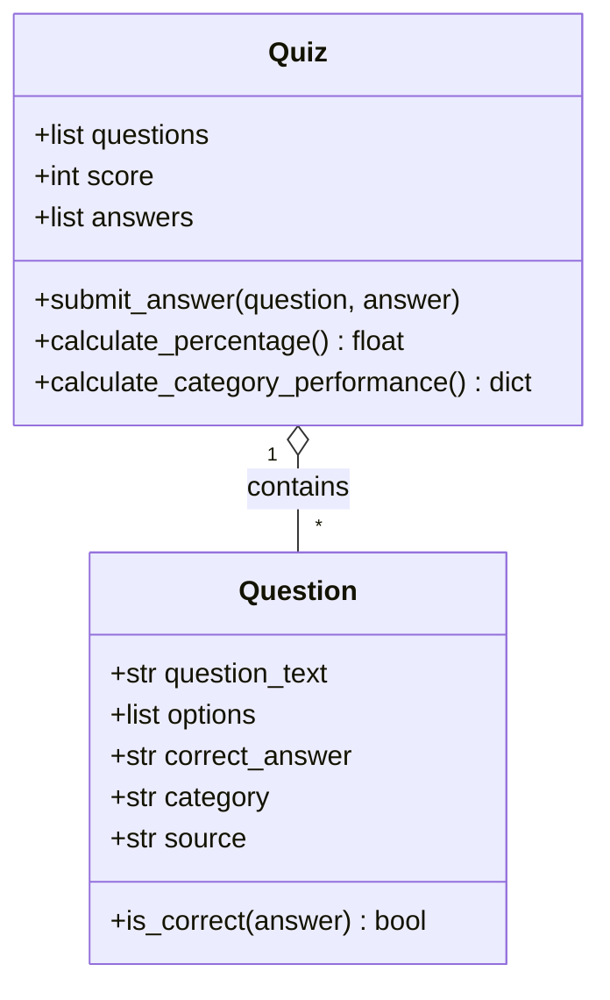
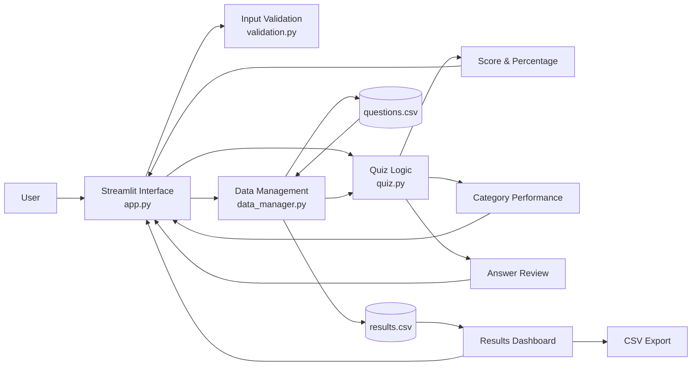

# UK Generations & Consumer Insight Quiz

## Introduction

The UK Generations & Consumer Insight Quiz is a Python application developed as a workplace-focused learning tool. Its purpose is to help employees test and develop their knowledge of UK generational demographics and consumer characteristics through an interactive multiple-choice quiz.

Understanding generational differences can support consumer insight work by providing context around population size, demographics, employment, earnings and consumer perceptions. Rather than presenting this information as a static document, I chose to create an interactive application so that users could actively test their knowledge and receive immediate feedback.

The quiz contains ten questions using demographic and population statistics from Statista reports, including data originally sourced from organisations such as the Office for National Statistics (ONS) and Ipsos. The source and category are displayed alongside each question so that the provenance and context of the information are visible to the user.

The original minimum viable product (MVP) was designed to allow a participant to enter their name, complete a multiple-choice quiz, receive a score and have the result stored persistently. During development, additional functionality was introduced once the core requirements were working reliably. This included category-level performance analysis, post-quiz answer review, a results dashboard, data visualisation and CSV export.

The application was developed using Python with Streamlit for the graphical user interface and pandas for data handling. Object-oriented programming was used for the core quiz logic, while pytest and GitHub Actions were used to support automated testing and continuous integration.

---

## Design

### User Journey


The user journey was designed to include both the successful path and error-handling routes. Invalid names return the user to the name-entry stage, while incomplete quizzes produce a warning rather than calculating a partial result. After successful submission, the participant receives increasingly detailed feedback before the result is stored and made available through the dashboard.

### Functional Requirements

| ID | Requirement |
|---|---|
| FR1 | The application shall allow a participant to enter their name. |
| FR2 | The application shall validate participant names before allowing the quiz to begin. |
| FR3 | The application shall load multiple-choice questions from persistent CSV storage. |
| FR4 | The application shall allow the participant to answer ten quiz questions through a GUI. |
| FR5 | The application shall prevent incomplete quizzes from being submitted. |
| FR6 | The application shall calculate and display the participant's score and percentage. |
| FR7 | The application shall classify a score of 70% or above as a pass. |
| FR8 | The application shall display performance by question category. |
| FR9 | The application shall provide post-quiz answer review and identify incorrect answers. |
| FR10 | The application shall save completed quiz results to persistent CSV storage. |
| FR11 | The application shall provide a dashboard containing stored results and summary metrics. |
| FR12 | The application shall visualise previous quiz performance. |
| FR13 | The application shall allow stored results to be exported as CSV. |

### Non-functional Requirements

| ID | Requirement |
|---|---|
| NFR1 | The application should provide a clear and easy-to-use interface. |
| NFR2 | Invalid user input should be handled without causing the application to crash. |
| NFR3 | Core application logic should be testable independently of the GUI. |
| NFR4 | The code should use meaningful names, type hints, comments and descriptive docstrings. |
| NFR5 | Quiz results should persist between application sessions. |
| NFR6 | Application responsibilities should be separated into maintainable modules. |
| NFR7 | Automated tests should run independently through continuous integration. |

### Technology Stack

| Technology | Purpose |
|---|---|
| Python 3.14.4 | Core programming language |
| Streamlit | Graphical user interface |
| pandas | CSV loading, manipulation and results analysis |
| pytest | Automated unit testing |
| Git | Local version control |
| GitHub | Remote repository and development history |
| GitHub Actions | Continuous integration |
| CSV | Persistent question and result storage |
| Mermaid | Technical diagrams and application documentation |

### Code Design



The application uses object-oriented programming to separate the responsibilities of individual questions from the overall quiz. The `Question` class stores the question text, answer options, correct answer, category and source, while its `is_correct()` method determines whether a submitted answer is correct.

The `Quiz` class manages a collection of `Question` objects, the participant's score and their submitted answers. Its methods handle answer submission, percentage calculation and category-level performance analysis.

This separation keeps the core quiz logic independent from the Streamlit interface. It also made test-driven development easier because the behaviour of the classes could be tested directly with pytest without needing to interact with the graphical interface.

### Application Architecture



The application follows a modular structure in which the Streamlit interface is separated from validation, quiz logic and data management. `app.py` coordinates the application but delegates specific responsibilities to other modules.

`validation.py` validates participant input, `quiz.py` contains the object-oriented quiz and scoring logic, and `data_manager.py` manages CSV loading and persistent result storage using pandas. This separation reduces duplication, improves maintainability and allows the core logic to be tested independently from the graphical interface.

---

## Development

### Object-Oriented Design

The core quiz behaviour was implemented using the `Question` and `Quiz` classes in `quiz.py`.

Each `Question` object represents one multiple-choice question and contains its text, four answer options, correct answer, category and source. The `is_correct()` method encapsulates the comparison between the participant's selected answer and the stored correct answer.

The `Quiz` class represents the overall quiz. It stores the collection of questions, maintains the participant's score and records submitted answers. When `submit_answer()` is called, the `Question.is_correct()` method is used to determine whether the score should increase. The submitted answer and its correctness are also retained so that the application can later provide answer review and category-level analysis.

Keeping this logic outside `app.py` was an important design decision. Streamlit is responsible for presentation and user interaction, while the classes are responsible for the underlying quiz rules. This makes the code easier to understand, reuse and test.

The `calculate_percentage()` method also handles the edge case of an empty quiz by returning `0.0`, preventing a division-by-zero error. Category performance is calculated by grouping the recorded answers by each question's category and calculating the number and percentage answered correctly.

### Data Handling

Quiz questions are stored in `data/questions.csv` rather than being hard-coded into the interface. This separates the data from the application logic and means that questions can be amended without rewriting the core Python classes.

The `load_questions()` function in `data_manager.py` uses pandas to read the CSV into a DataFrame. Each row is then converted into a `Question` object containing the question text, four options, correct answer, category and source.

Completed quiz attempts are stored in `data/results.csv`. The `save_result()` function creates a record containing the participant's name, date and time, score, number of questions, percentage and pass result. pandas is then used to append this information to CSV storage.

The application also uses pandas to load previous attempts for the results dashboard. The stored data is used to calculate the total number of attempts, average percentage score and pass rate. Previous scores are displayed in a table and visualised over time, and the DataFrame can be exported through the Streamlit download control.

### Input Validation and Exception Handling

Participant names are validated before the quiz is displayed. Validation is separated into `validation.py` so that it can be tested independently from the graphical interface.

A regular expression is used to accept names containing letters and spaces while rejecting invalid input such as numbers. For example, a normal participant name is accepted while an input such as `Daniel123` is rejected and produces a clear validation message in the interface.

Exception handling is also used when reading persistent data. Missing question files, malformed CSV data and empty result files are handled without allowing an unhandled exception to terminate the application.

An important integration issue was discovered during development when an existing but empty `results.csv` file was interpreted incorrectly. This resulted in result data being written without the expected header structure and later caused the dashboard to raise a `KeyError` when looking for the `percentage` column.

The storage logic was improved so that an existing results file is checked for meaningful content and the expected columns before new data is appended. The result-loading function also validates the structure of stored data and returns an empty DataFrame when usable results are unavailable. This made the application more resilient to missing, empty or malformed result storage.

### Graphical User Interface

Streamlit was selected for the graphical user interface because it provides interactive Python controls while allowing the project to remain focused on Python programming and data handling.

The interface begins with a participant-name input. Once validated, ten multiple-choice questions are displayed using radio buttons. Each question also displays its category and source to provide transparency about the underlying data.

When the participant submits the quiz, the application first checks whether every question has been answered. An incomplete quiz produces a warning rather than a partial score.

A completed quiz displays the participant's raw score, percentage and pass status. A score of 70% or above is classified as a pass. Additional feedback then shows performance by category and an answer-review section. Incorrect responses display both the participant's answer and the correct answer, allowing the application to function as a learning tool rather than only an assessment tool.

The results dashboard displays total attempts, average score, pass rate, performance over time and previous result records. Users can also download the stored result data as a CSV file.

---

## Testing

### Testing Strategy

A combination of automated unit testing, test-driven development, manual testing and continuous integration was used.

Automated unit tests were used for deterministic core behaviour such as answer checking, score calculation, validation, category analysis and persistent data handling. Manual testing was used for complete user journeys and features involving the Streamlit interface, such as warnings, result presentation, dashboard updates and downloads.

Continuous integration was added using GitHub Actions so that the automated test suite is executed in a separate environment whenever changes are pushed to the `main` branch.

This combination provided different levels of assurance. Unit tests checked individual pieces of logic, manual testing checked the integrated user experience, and continuous integration verified that the test suite also passed outside the local development environment.

### Test-Driven Development

Test-driven development was used for important parts of the core application.

For example, tests for the `Question` class were written to define the expected behaviour for correct and incorrect answers. Initially the required implementation did not exist, causing the test to fail. The minimum implementation was then added to `quiz.py` until the tests passed.

The same RED-GREEN approach was used when introducing quiz scoring and persistent result storage. A test was first created for the expected behaviour, such as a new quiz starting with a score of zero or a completed result creating a CSV file. The implementation was then developed to satisfy the test.

This approach helped define expected behaviour before implementation and reduced the risk of changing existing functionality when new features were introduced.

### Automated Unit Testing

The final pytest suite contains **15 passing tests** covering the core application logic.

Tests include:

- correct answers returning `True`;
- incorrect answers returning `False`;
- new quizzes starting at zero;
- correct answers increasing the score;
- percentage calculation;
- safe handling of an empty quiz;
- category-level performance calculation;
- maximum-score boundary behaviour;
- zero-score boundary behaviour;
- participant-name validation;
- result-file creation;
- stored result content and columns;
- loading saved results into a pandas DataFrame.

Boundary tests were deliberately included for both a completely correct and completely incorrect quiz. These verify that the scoring logic correctly produces 100% at the upper boundary and 0% at the lower boundary.

Running:

```powershell
python -m pytest
```

executes the complete automated test suite.

### Manual Testing

Manual testing was performed alongside automated unit testing to verify the complete user journey and the interaction between the graphical interface, quiz logic and persistent data storage.

| ID | Test | Expected result | Actual result | Status |
|---|---|---|---|---|
| M01 | Enter a valid participant name | Quiz becomes available | Quiz displayed successfully | Pass |
| M02 | Enter a name containing numbers | Validation error displayed | Validation error displayed | Pass |
| M03 | Submit with unanswered questions | Warning displayed and quiz not scored | Warning displayed | Pass |
| M04 | Complete quiz with mixed answers | Score and percentage calculated correctly | 4/10, 7/10, 6/10 and 5/10 results calculated correctly | Pass |
| M05 | Display category performance | Category scores should reconcile with overall score | Category totals reconciled with overall quiz results | Pass |
| M06 | Review answers after submission | Correct and incorrect answers clearly identified | Selected answers and correct answers displayed as expected | Pass |
| M07 | Save quiz result | Completed result written to persistent CSV storage | Result written successfully to `results.csv` | Pass |
| M08 | Display results dashboard | Dashboard shows stored metrics and previous attempts | Metrics, chart and results table displayed correctly | Pass |
| M09 | Export results | User can download stored results as CSV | CSV downloaded successfully | Pass |
| M10 | Empty results file | No-results message displayed without application crash | Empty state handled correctly | Pass |
| M11 | GitHub Actions | Push triggers automated tests | GitHub Actions workflow completed successfully | Pass |

Manual and integration testing identified the issue with the empty results file described previously. After the storage and loading logic was updated, the scenario was re-tested successfully. This demonstrated the value of using manual integration testing alongside unit tests, because the individual components had passed their tests while the interaction with the real persistent file exposed an additional issue.

### Continuous Integration

GitHub Actions is configured to run the automated pytest suite whenever code is pushed to the `main` branch or a pull request targets `main`.

The workflow checks out the repository, creates an Ubuntu environment, installs Python and the required dependencies, and executes:

```text
python -m pytest
```

A successful workflow run provides independent confirmation that the project and its automated tests work outside the local development environment. This also provides a repeatable quality check for future changes to the repository.

---

## Documentation

### User Documentation

To use the application:

1. Install the project dependencies.
2. Run the Streamlit application from the project directory:

```powershell
python -m streamlit run app.py
```

3. Open the local Streamlit address displayed in the terminal if it does not open automatically.
4. Enter a participant name containing letters and spaces.
5. Answer all ten multiple-choice questions.
6. Select **Submit Quiz**.
7. Review the overall score, percentage and pass status.
8. Review performance by category and the answer-review feedback.
9. View historical results in the results dashboard.
10. Use **Download Results CSV** if an exported copy of the stored results is required.

The application displays a validation message for an invalid participant name and warns the user if questions have been left unanswered.

### Technical Documentation

The application requires Python and the packages listed in `requirements.txt`.

A virtual environment can be created and activated before installing the dependencies. From the project directory, dependencies can be installed using:

```powershell
python -m pip install -r requirements.txt
```

The application can then be started using:

```powershell
python -m streamlit run app.py
```

Automated tests can be executed locally using:

```powershell
python -m pytest
```

The main project files are:

| File | Responsibility |
|---|---|
| `app.py` | Streamlit interface and coordination of the application |
| `quiz.py` | `Question` and `Quiz` classes and core quiz logic |
| `validation.py` | Participant-name validation |
| `data_manager.py` | Loading questions and reading/writing persistent results |
| `data/questions.csv` | Persistent quiz-question dataset |
| `data/results.csv` | Persistent completed-result storage |
| `tests/` | Automated pytest test suite |
| `.github/workflows/tests.yml` | GitHub Actions continuous-integration workflow |

---

## Evaluation

The project successfully met the original aim of creating a workplace-focused application for testing knowledge of UK generations and consumer characteristics. The final application goes beyond the initial MVP by combining assessment, learning feedback and results analysis within one interface.

One of the strongest aspects of the solution is its modular structure. Separating the user interface, validation, data management and object-oriented quiz logic made the project easier to develop incrementally and allowed the core behaviour to be tested independently. The use of CSV files also keeps the data separate from the Python implementation, making the question set easier to maintain.

Test-driven development was valuable during the implementation of the core classes and persistent storage. Writing tests before implementation helped define the required behaviour and provided immediate feedback as the application developed. The final automated suite covers normal behaviour, edge cases and scoring boundaries, while GitHub Actions provides an additional independent check whenever code is pushed.

Manual integration testing was equally important. The most significant issue discovered during development involved the interaction between an existing empty `results.csv` file and the dashboard. Although individual unit tests were passing, the real application exposed a malformed-data scenario that resulted in a `KeyError`. Improving the storage and loading logic and then re-testing the empty-file scenario made the final solution more robust.

The category-performance and answer-review features improved the practical value of the application beyond simply reporting a score. Participants can identify areas where their knowledge is weaker and can see the correct answer when they make a mistake. The results dashboard also provides a simple way to monitor previous attempts and export the underlying data.

There are still limitations. CSV storage is appropriate for the scope of this project but would be less suitable for a larger multi-user deployment because simultaneous writes, access control and larger volumes of data would be better handled by a database. The current quiz also displays all ten questions on one page, which creates a relatively long interface. A future version could present questions individually or in smaller sections.

Further development could include authentication, role-based access to the results dashboard, a database backend, administration tools for maintaining questions, additional quiz topics and richer analysis of performance over time. These changes were deliberately excluded from the current version to avoid unnecessary scope expansion once the core requirements and planned enhancements had been completed reliably.

Overall, the project demonstrates the use of Python programming, object-oriented design, pandas data handling, regular-expression validation, exception handling, persistent storage, graphical user-interface development, automated testing, continuous integration and technical documentation in a practical workplace-focused solution.