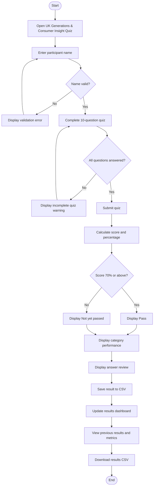
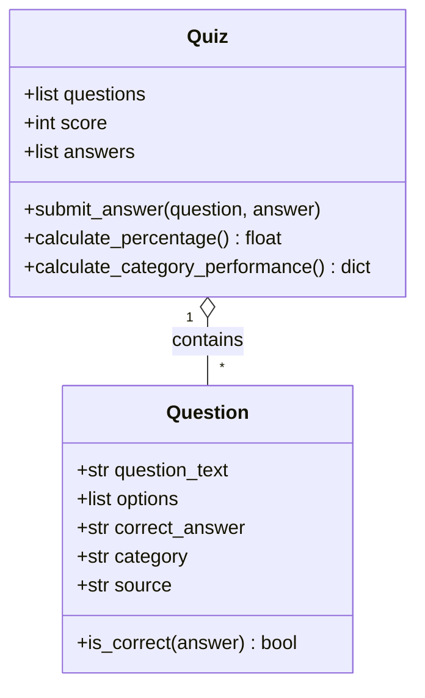
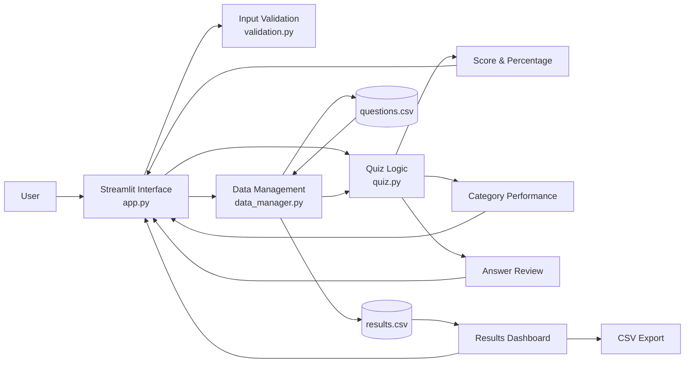

# UK Generations & Consumer Insight Quiz

## Introduction

The UK Generations & Consumer Insight Quiz is a Python application developed for use within my workplace. The application is designed to test and develop employees' knowledge of UK generational demographics and consumer characteristics through an interactive multiple-choice quiz.

The quiz uses demographic and population statistics from Statista reports, including data originally sourced from organisations such as the Office for National Statistics (ONS) and Ipsos.

<!-- Complete Introduction later: workplace context, business relevance, intended users and MVP purpose. Target: approximately 300 words. -->

## Design

### User Journey

### Functional Requirements

| ID | Requirement |
|---|---|
| FR1 | The application shall allow a participant to enter their name. |
| FR2 | The application shall validate participant names before allowing the quiz to begin. |
| FR3 | The application shall load multiple-choice questions from persistent storage. |
| FR4 | The application shall allow the participant to answer quiz questions through a GUI. |
| FR5 | The application shall calculate and display the participant's score and percentage. |
| FR6 | The application shall save completed quiz results to persistent storage. |
| FR7 | The application shall allow stored results to be viewed. |
| FR8 | The application shall allow results to be exported. |

### Non-functional Requirements

| ID | Requirement |
|---|---|
| NFR1 | The application should provide a clear and easy-to-use interface. |
| NFR2 | Invalid user input should be handled without causing the application to crash. |
| NFR3 | Core application logic should be testable independently of the GUI. |
| NFR4 | The code should use meaningful names, type hints and descriptive docstrings. |
| NFR5 | Quiz results should persist between application sessions. |

### Technology Stack

| Technology | Purpose |
|---|---|
| Python 3.14.4 | Core programming language |
| Streamlit | Graphical user interface |
| pandas | CSV loading, manipulation and results analysis |
| pytest | Automated unit testing |
| Git/GitHub | Version control and remote repository |
| GitHub Actions | Continuous integration |
| CSV | Persistent question and result storage |

### Code Design

The application uses object-oriented programming to separate the responsibilities of individual questions from the overall quiz. The `Question` class stores the question text, answer options, correct answer, category and source, while its `is_correct()` method checks a submitted answer.

The `Quiz` class manages a collection of `Question` objects, the participant's score and their submitted answers. Its methods handle answer submission, percentage calculation and category-level performance analysis. Separating these responsibilities keeps the core quiz logic independent from the Streamlit user interface and makes the classes easier to test using pytest.

### Application Architecture

The application follows a modular structure in which the Streamlit interface is separated from validation, quiz logic and data management. `app.py` coordinates the user interface but delegates specific responsibilities to the other modules.

`validation.py` validates participant input, `quiz.py` contains the object-oriented quiz and scoring logic, and `data_manager.py` manages CSV loading and persistent result storage using pandas. This separation reduces duplication, improves maintainability and allows the core logic to be tested independently from the graphical interface.

## Development

### Object-Oriented Design

<!-- Explain Question and Quiz classes with selected code examples. -->

### Data Handling

<!-- Explain CSV question storage and pandas loading. -->

### Input Validation and Exception Handling

<!-- Explain pure validation functions, regex and exception handling. -->

### Graphical User Interface

<!-- Explain Streamlit implementation. -->

## Testing

### Testing Strategy

<!-- Explain TDD, unit testing, integration/manual testing and why each was selected. -->

### Test-Driven Development

<!-- Add RED/GREEN evidence captured during development. -->

### Automated Unit Testing

<!-- Add final pytest screenshot and explain important tests. -->

### Manual Testing

### Manual Testing

Manual testing was performed alongside automated unit testing to verify the complete user journey and the interaction between the graphical interface, quiz logic and persistent data storage.

| ID | Test | Expected result | Actual result | Status |
|---|---|---|---|---|
| M01 | Enter a valid participant name | Quiz becomes available | Quiz displayed successfully | Pass |
| M02 | Enter a name containing numbers | Validation error displayed | Validation error displayed | Pass |
| M03 | Submit with unanswered questions | Warning displayed and quiz not scored | Warning displayed | Pass |
| M04 | Complete quiz with mixed answers | Score and percentage calculated correctly | 4/10, 7/10 and 6/10 were calculated correctly | Pass |
| M05 | Display category performance | Category scores should reconcile with overall score | Category totals reconciled with the overall 6/10 result | Pass |
| M06 | Review answers after submission | Correct and incorrect answers should be clearly identified | Answer review displayed selected and correct answers | Pass |
| M07 | Save quiz result | Completed result should be written to persistent CSV storage | Result written successfully to `results.csv` | Pass |
| M08 | Display results dashboard | Dashboard should show stored metrics and previous attempts | Metrics, chart and results table displayed correctly | Pass |
| M09 | Export results | User should be able to download stored results as CSV | CSV download completed successfully | Pass |
| M10 | Empty results file | Application should display a no-results message without crashing | No-results message displayed correctly | Pass |
| M11 | GitHub Actions | Push should trigger automated tests | GitHub Actions completed successfully | Pass |

The manual tests covered both normal user behaviour and edge cases. Testing identified an integration issue where an empty results file could cause the dashboard to interpret the data incorrectly. The result-storage logic was subsequently updated to validate the structure of the existing CSV before appending new results. Re-testing confirmed that the application could handle an empty results file correctly.

### Continuous Integration

<!-- Add GitHub Actions screenshot and explanation. -->

## Documentation

### User Documentation

<!-- Explain how an employee installs/opens and uses the application. -->

### Technical Documentation

<!-- Explain environment setup, dependencies, running the application and running tests. -->

## Evaluation

<!-- Reflect on successes, problems encountered, limitations and future improvements. -->