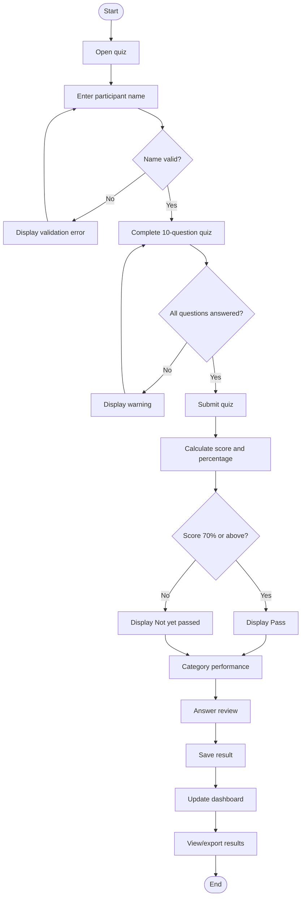
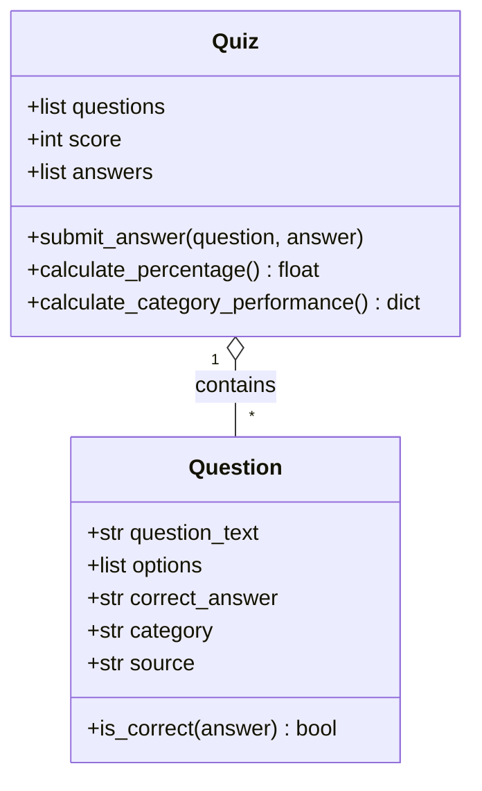
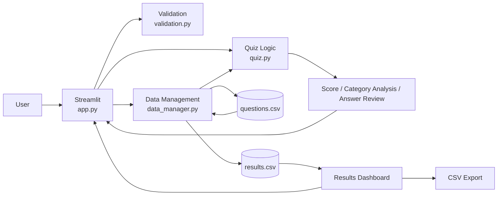
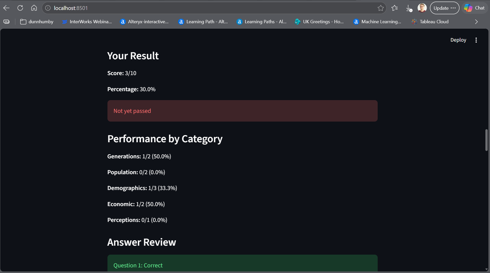
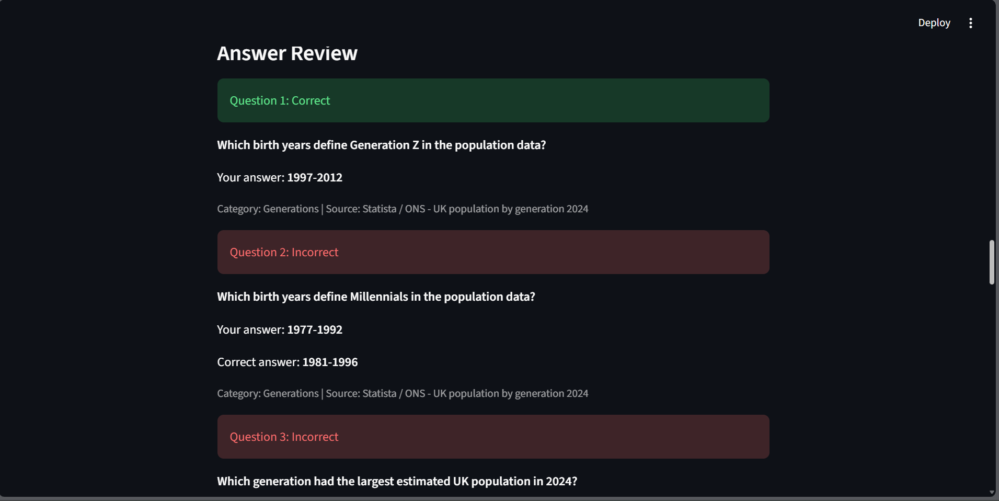
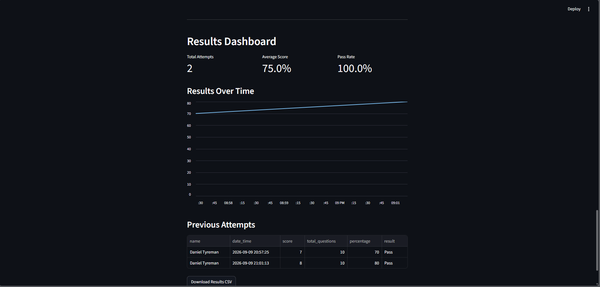
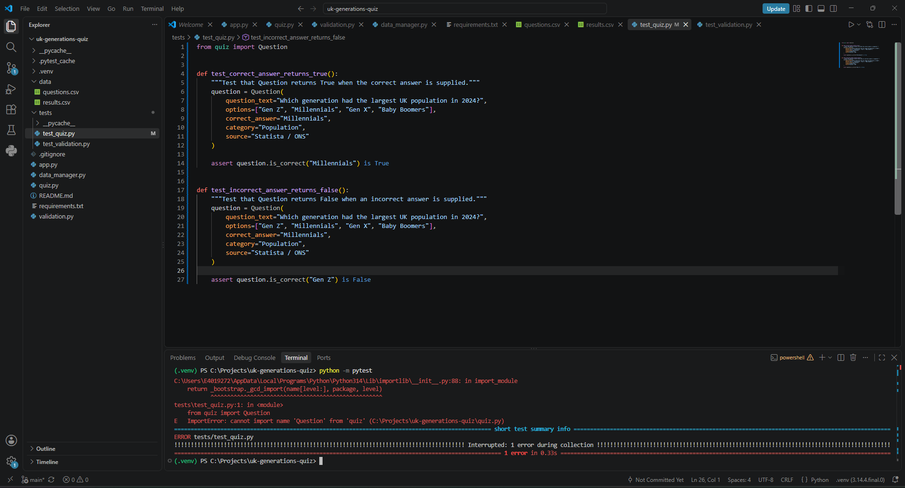
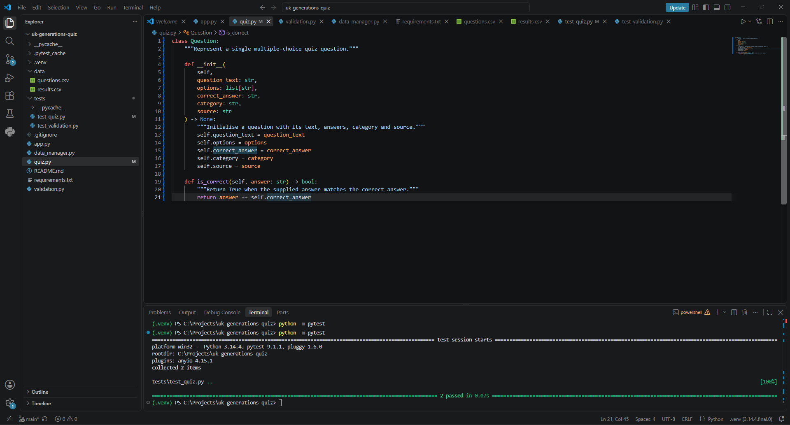
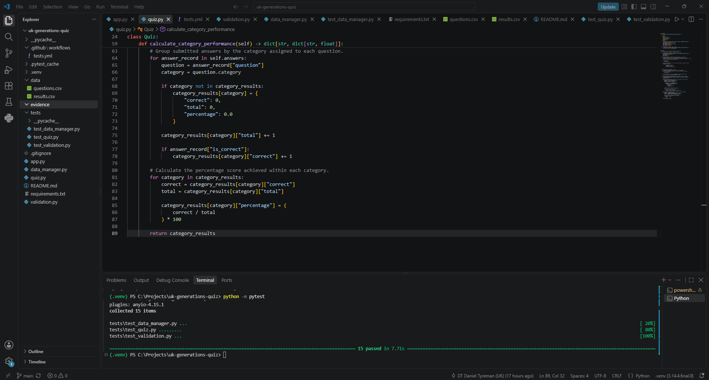
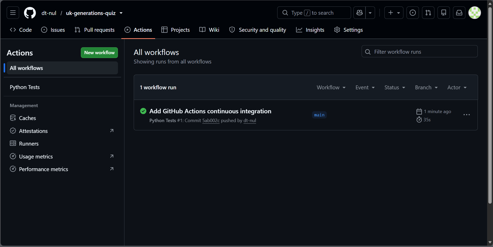

# UK Generations & Consumer Insight Quiz

## Introduction

The UK Generations & Consumer Insight Quiz is a workplace-focused Python application designed to help employees test and develop their knowledge of UK generational demographics and consumer characteristics.

Understanding generational differences provides useful context for consumer insight, including population, demographics, employment, earnings and perceptions. I chose an interactive quiz rather than a static document so users could actively test their knowledge and receive immediate feedback.

The ten questions use statistics from Statista reports, including data originally sourced from organisations such as the Office for National Statistics (ONS) and Ipsos. Each question displays its category and source to make the provenance of the information visible.

The original minimum viable product (MVP) covered name entry, a multiple-choice quiz, scoring and persistent result storage. Once this worked reliably, I added category performance, answer review, a results dashboard, visualisation and CSV export. Python provides the core logic, Streamlit the interface, pandas the data handling, and pytest/GitHub Actions the testing and continuous integration.

---

## Design

### User Journey



The journey includes both successful and error-handling paths. Invalid names return to name entry and incomplete quizzes produce a warning rather than a partial result.

### Functional Requirements

| ID | Requirement |
|---|---|
| FR1 | Accept and validate a participant name. |
| FR2 | Load ten multiple-choice questions from CSV storage. |
| FR3 | Allow questions to be answered through a GUI and prevent incomplete submission. |
| FR4 | Calculate score, percentage and a 70% pass threshold. |
| FR5 | Display category-level performance and post-quiz answer review. |
| FR6 | Save completed results persistently. |
| FR7 | Display stored results, summary metrics and performance over time. |
| FR8 | Allow stored results to be exported as CSV. |

### Non-functional Requirements

| ID | Requirement |
|---|---|
| NFR1 | Provide a clear and easy-to-use interface. |
| NFR2 | Handle invalid input and data errors without crashing. |
| NFR3 | Keep core logic independently testable and modular. |
| NFR4 | Use meaningful names, type hints, comments and docstrings. |
| NFR5 | Persist results between application sessions. |
| NFR6 | Run automated tests through continuous integration. |

### Technology Stack

| Technology | Purpose |
|---|---|
| Python 3.14.4 | Core programming language |
| Streamlit | Graphical user interface |
| pandas | CSV and DataFrame processing |
| pytest | Automated testing |
| Git/GitHub | Version control |
| GitHub Actions | Continuous integration |
| CSV | Persistent data storage |
| Mermaid | Technical diagrams |

### Code Design



`Question` represents one multiple-choice question and checks whether an answer is correct. `Quiz` manages the question collection, score, submitted answers, percentage and category analysis. Separating this business logic from Streamlit made it easier to test independently and reduced coupling between presentation and scoring.

### Application Architecture



The modular architecture separates interface, validation, quiz logic and data management. This improves maintainability and allows core behaviour to be tested without the graphical interface.

---

## Development

### Core Logic and Data Handling

The `Question` and `Quiz` classes in `quiz.py` contain the core object-oriented logic. `Question.is_correct()` encapsulates answer checking, while `Quiz.submit_answer()` updates the score and records each response. Recorded responses support both category analysis and post-quiz answer review. `calculate_percentage()` safely returns `0.0` for an empty quiz, avoiding division by zero.

Questions are stored in `data/questions.csv` rather than hard-coded into the interface. `data_manager.py` uses pandas to load each CSV row and create a `Question` object. Completed attempts are written to `data/results.csv` with the participant name, timestamp, score, total questions, percentage and result. pandas also provides the DataFrame used for dashboard metrics, visualisation and export.

### Validation and Exception Handling

`validation.py` separates participant-name validation from the interface. A regular expression accepts letters and spaces while rejecting values such as `Daniel123`.

Data-loading functions handle missing, empty or malformed CSV files. This became important during integration testing when an empty `results.csv` was treated as existing data, resulting in missing headers and a dashboard `KeyError` for `percentage`.

I changed the storage logic to check both file content and expected columns before appending data. `load_results()` also returns an empty DataFrame when usable results are unavailable. Re-testing confirmed that an empty results file now produces a clear no-results message instead of crashing.

### Graphical User Interface

Streamlit provides the user interface while the underlying logic remains in separate modules. Users enter a validated name, answer ten sourced questions using radio buttons and cannot submit until every question has an answer.

After submission the application displays score, percentage and pass status, followed by category performance and answer review. Incorrect responses reveal the correct answer, turning the application into a learning tool rather than only a scoring mechanism.





The dashboard provides total attempts, average score, pass rate, historical results, a performance chart and CSV download.



---

## Testing

### Strategy and Test-Driven Development

I used automated unit testing, TDD, manual integration testing and continuous integration. Unit tests cover deterministic logic, while manual tests verify complete Streamlit workflows and interaction with persistent storage.

TDD was used for core functionality. For example, the expected `Question` behaviour was expressed as a test before the implementation existed, producing a RED state. I then implemented the minimum required behaviour until the test passed (GREEN).

**RED – test written before implementation:**



**GREEN – implementation satisfies the test:**



The same approach was used during quiz scoring and validation development. Additional RED/GREEN evidence is retained in the repository's `evidence` folder.

### Automated Testing

The final pytest suite contains **15 passing tests** covering answer checking, scoring, percentage calculation, empty-quiz handling, category analysis, validation and result persistence. Boundary tests verify both 0% and 100% scoring behaviour.



Tests are run locally with:

```powershell
python -m pytest
```

### Manual Testing

| ID | Test | Expected result | Actual result | Status |
|---|---|---|---|---|
| M01 | Valid name | Quiz displayed | Quiz displayed | Pass |
| M02 | Name containing numbers | Validation error | Validation error | Pass |
| M03 | Unanswered questions | Warning; no score | Warning displayed | Pass |
| M04 | Mixed answers | Correct score/percentage | Multiple scores verified | Pass |
| M05 | Category analysis | Totals reconcile to score | Totals reconciled | Pass |
| M06 | Answer review | Correct/incorrect feedback | Feedback displayed | Pass |
| M07 | Save result | CSV updated | Result saved | Pass |
| M08 | Dashboard | Metrics/table/chart shown | Displayed correctly | Pass |
| M09 | CSV export | Results downloaded | Download successful | Pass |
| M10 | Empty results file | No crash | Empty state displayed | Pass |
| M11 | CI | Push runs tests | Workflow successful | Pass |

The empty-results-file defect was found through integration testing even though individual unit tests were passing. This demonstrated why unit and manual testing were both necessary.

### Continuous Integration

GitHub Actions runs pytest on pushes and pull requests to `main`, providing an independent check in an Ubuntu environment.



---

## Documentation

### Running the Application

Install dependencies:

```powershell
python -m pip install -r requirements.txt
```

Run the application:

```powershell
python -m streamlit run app.py
```

Enter a valid name, answer all ten questions and select **Submit Quiz**. The application then displays the result, category analysis and answer review. Previous attempts appear in the dashboard and can be downloaded as CSV.

Run automated tests with:

```powershell
python -m pytest
```

### Project Structure

| File | Responsibility |
|---|---|
| `app.py` | Streamlit interface |
| `quiz.py` | Question and quiz logic |
| `validation.py` | Name validation |
| `data_manager.py` | CSV loading and result persistence |
| `data/` | Question and result storage |
| `tests/` | pytest suite |
| `.github/workflows/tests.yml` | CI workflow |
| `evidence/` | Development and testing evidence |

---

## Evaluation

The project met its original workplace-learning aim and exceeded the MVP by adding category analysis, answer review, persistent reporting and export. The modular structure is a key strength: separating Streamlit, validation, data handling and quiz logic supported incremental development and independent testing.

TDD provided clear expected behaviour while GitHub Actions added repeatable independent verification. Manual integration testing was equally valuable because it exposed the empty-results-file problem that isolated tests had not revealed. Fixing and re-testing this issue improved resilience and demonstrated the importance of testing components together as well as individually.

Category performance and answer review add practical value by helping participants identify weaker knowledge areas and learn from incorrect responses. The dashboard provides a simple view of previous attempts and makes the underlying results reusable through CSV export.

CSV storage is appropriate for this project's scope but is the main technical limitation. A larger multi-user application would benefit from a database to improve concurrent access, security and scalability. The ten-question single-page layout also requires substantial scrolling.

Future development could therefore include a database backend, authentication and role-based dashboard access, question administration and paginated quiz navigation. I deliberately excluded these once the planned enhancements were complete to avoid unnecessary scope expansion and preserve a reliable, tested final application.